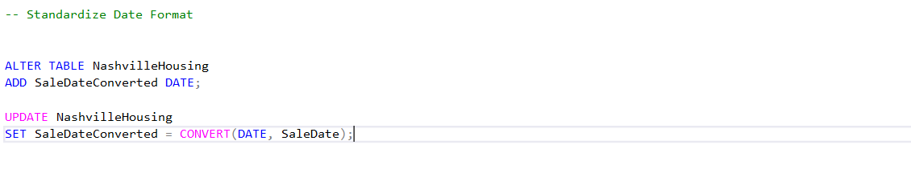
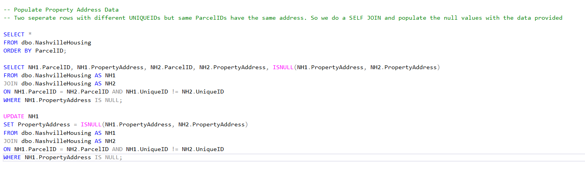
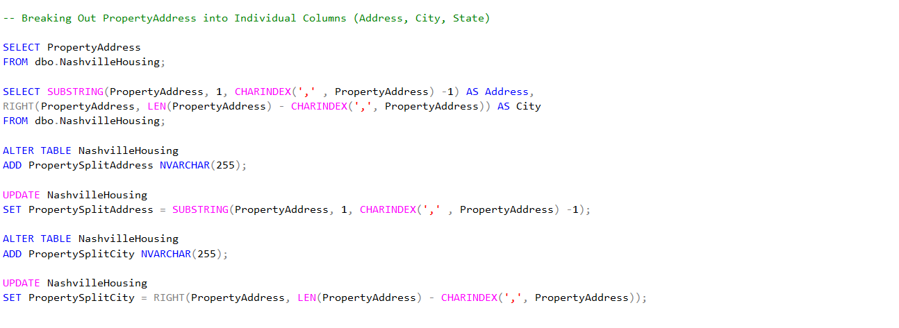
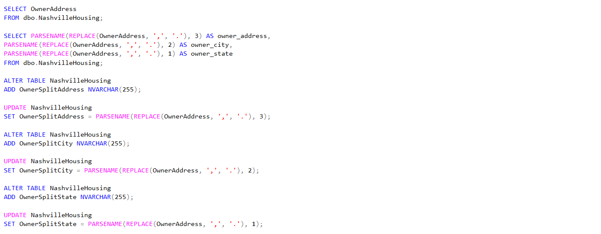
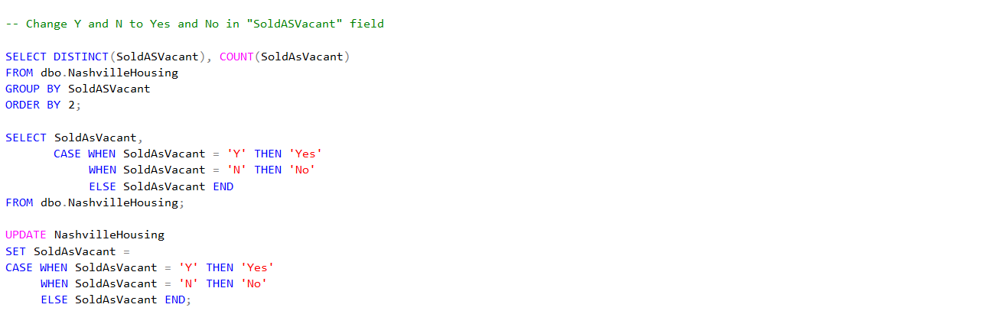
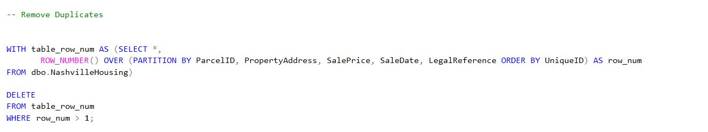
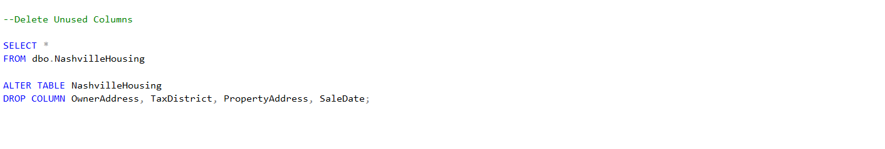

# SQL_Data_Cleaning

## Purpose
The purpose of this project is to clean the Nashville Housing Dataset using MS SQL.

## Data Source

[Click Here](https://github.com/Sukanya807/SQL_Data_Cleaning/blob/main/Nashville%20Housing%20Data%20for%20Data%20Cleaning.xlsx) to download the Excel file.

## Tools Used

MS SQL Server Management Studio

## Data Cleaning

The following changes were made to the raw dataset to perform data cleaning for further use.

1. Standardize Date Format from TIMESTAMP

2. Replace NULL values with data using SELF JOINS

3. Breaking Out PropertyAddress into Individual Columns (Address, City, State) using SUBSTRING AND CHARINDEX

4. Breaking Out OwnerAddress into Individual Columns (Address, City, State) using PARSENAME

5. Change Y and N to Yes and No in "SoldASVacant" field using CASE statements

6. Remove Duplicates with cte

7. Delete Unused Columns

